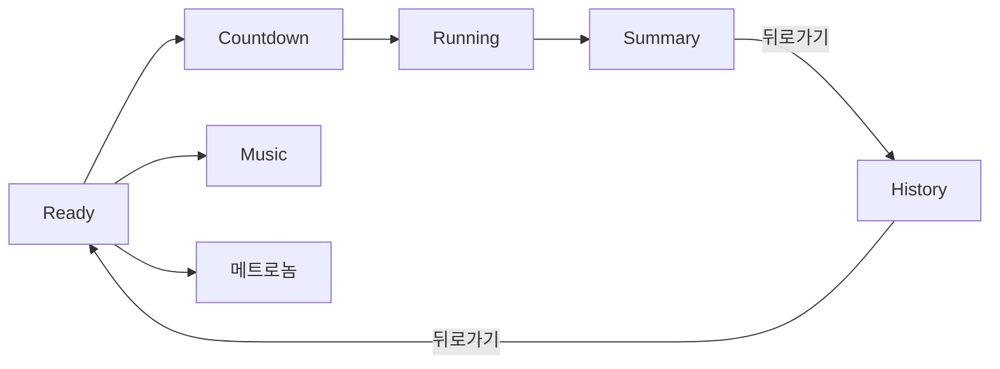
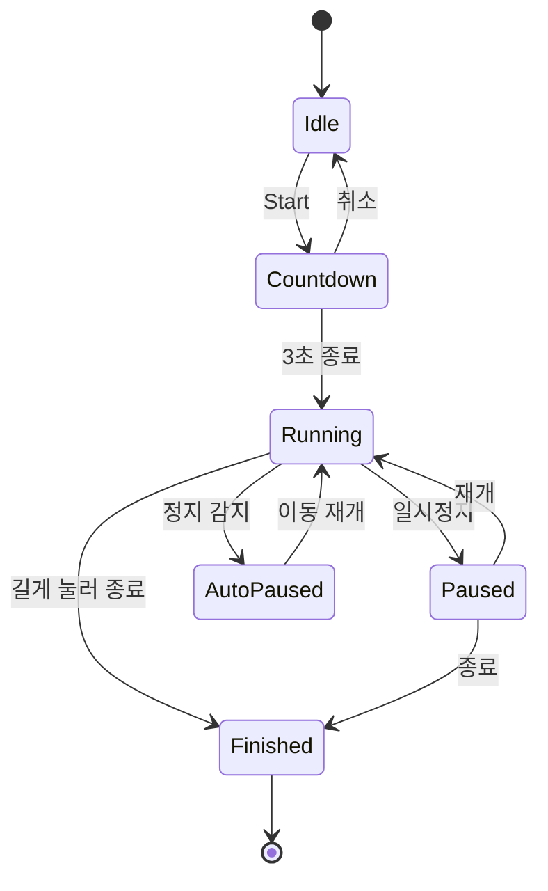
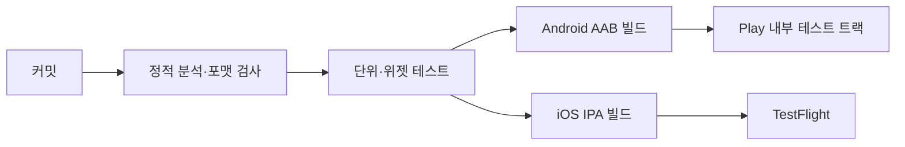

# 러닝앱 Flutter 구현 지침

2026-09-20 · @Someone

## 이번에 보강한 사항

기존 지침에 Flutter 특화 사항, 스토어 심사 대응, 편안한 UI 테마를 더했습니다. 출시 리스크가 가장 큰 항목은 백그라운드 실행, 메트로놈 정확도, 스토어 심사입니다.

| 구분 | 보강 내용 | 섹션 |
| --- | --- | --- |
| UI 테마 | 부드러운 색, 둥근 모서리, 큰 숫자, 옅은 지도 스타일, 다크모드 토큰 | 3 |
| Flutter 구조 | 상태관리, 라우팅, DB, 위치·오디오 패키지 후보와 레이어 구조 | 2 |
| 백그라운드 | Dart 코드만으로는 부족, 플러그인과 필요 시 네이티브 코드를 병행 | 8 |
| 메트로놈 | Dart Timer 금지, 오디오 엔진 클록 기반 저지연 재생 | 6 |
| 음악 연동 | 1차는 외부 앱 병행 재생과 오디오 믹싱, SDK 연동은 2차 | 6 |
| 케이던스 | iOS/Android 센서 차이, 백그라운드 보정, 센서 없는 기기 대응 | 5 |
| 지도 | Google Maps, MapLibre/OSM, 네이버 지도 선택 기준 | 2, 3 |
| 권한 플로우 | 요청 순서와 거부 시 대체 화면 | 8 |
| 스토어 배포 | 심사용 권한 사유, 개인정보처리방침, 데이터 안전 양식, 서명, CI/CD | 10 |
| 데이터 내보내기 | GPX 내보내기, 결과 공유 이미지 | 4 |
| 테스트 | GPX 재생 시뮬레이션, 야외 실기기 체크리스트 | 11 |
| 다국어·접근성 | 한국어/영어, 글자 크기, 음성 안내 | 11 |

## 1. 목표, 범위, 전제

Flutter 단일 코드베이스로 iOS(App Store)와 Android(Google Play)에 동시에 출시하는 러닝 기록 앱을 만듭니다.

**1차 출시(MVP) 범위**

- 러닝 시작 화면, 3초 카운트다운, 러닝 중 화면, 완료 화면, 일별 기록
- 거리, 속도, 케이던스 측정과 1km 스플릿
- 속도 색상 경로 지도
- 메트로놈, 타이머(연속·반복), Music 설정
- 설정, 권한 안내, 로컬 저장

**2차 이후**

- 워치·심박·외부 케이던스 센서 연동
- 음악 스트리밍 SDK 직접 연동
- 클라우드 동기화, 계정, 소셜 공유

**전제**

- 최소 지원 OS는 iOS 15 이상, Android 8.0(API 26) 이상을 기본안으로 합니다. 출시 시점의 스토어 요구 버전에 맞춰 조정합니다.
- 데이터는 기기 내 저장이 기본이고 서버는 두지 않습니다.
- 러닝 도중 화면이 꺼져도 기록이 끊기지 않는 것이 최우선 품질 기준입니다.
- 이 앱은 운동 기록 용도이며 의료기기가 아닙니다. 스토어 설명과 앱 내 문구에 이를 반영합니다.

## 2. 기술 스택과 프로젝트 구조

러닝 로직은 UI와 분리된 서비스 계층에 두고, 화면은 서비스의 상태 스트림을 구독만 합니다. 아래 패키지는 후보이며, 채택 전에 최신 버전, 유지보수 상태, iOS/Android 동시 지원 여부를 확인합니다.

| 영역 | 후보 | 비고 |
| --- | --- | --- |
| 상태관리 | Riverpod | 러닝·타이머·메트로놈 서비스 상태를 스트림으로 노출 |
| 라우팅 | go\_router | 공통 상단바를 ShellRoute로 고정 |
| 로컬 DB | drift (SQLite) | 일별 조회용 startedAt 인덱스 |
| 위치 | geolocator | Android 포그라운드 서비스 알림 설정, iOS 백그라운드 위치 옵션 지원 |
| 걸음·케이던스 | pedometer 계열 + 플랫폼 채널 | iOS CMPedometer 세부 값은 채널 직접 구현 가능성 있음 |
| 지도 | google\_maps\_flutter, flutter\_map(MapLibre/OSM), flutter\_naver\_map | 선택 기준은 3.5절 |
| 오디오 세션 | audio\_session | 덕킹, 인터럽트 복구 |
| 음악 재생 | just\_audio, audio\_service | 로컬 파일 재생과 미디어 알림 |
| 메트로놈 | 저지연 엔진(flutter\_soloud 등) 또는 네이티브 채널 | 6.1절 |
| 음성 안내 | flutter\_tts 또는 사전 녹음 파일 | 지연을 줄이려면 녹음 파일 권장 |
| 권한 | permission\_handler | 단계별 요청 |
| 화면 켜짐 | wakelock\_plus | 설정에서 선택 |
| 알림 | flutter\_local\_notifications | 타이머 전환, 복구 안내 |
| 내보내기 | share\_plus, path\_provider | GPX 파일, 공유 이미지 |

**폴더 구조 (기능 단위)**

```text
lib/
  app/            # 앱 진입, 라우터, 테마(토큰)
  core/           # 공통 유틸, 단위 변환, 로거, 권한
  features/
    run/          # 상태머신, 위치·케이던스 수집, 스플릿
    map/          # 지도 위젯, 경로 색상
    metronome/    # 오디오 엔진 래퍼, 설정
    music/        # 음악 소스 설정
    timer/        # 인터벌 시퀀스 엔진, 프리셋
    history/      # 일별 기록, 달력
    settings/
  data/           # drift DB, 리포지토리
  platform/       # 플랫폼 채널, 네이티브 브리지 인터페이스
android/          # 포그라운드 서비스, 매니페스트
ios/              # Background Modes, Info.plist
```

**계층 원칙**

- features는 서로 직접 참조하지 않고 서비스 인터페이스로만 통신합니다.
- 위치와 센서는 인터페이스 뒤에 두어 GPX 재생 같은 가짜 소스로 교체할 수 있게 합니다.
- 위치 스트림이 살아 있는 동안 앱 프로세스가 유지되므로 Dart 서비스가 백그라운드에서도 동작합니다. 다만 기기별 동작 차이가 크므로 실기기로 반드시 검증합니다(8장).

## 3. 편안한 UI 테마

따뜻한 크림 배경, 둥근 모서리, 낮고 넓은 그림자, 격려하는 문구로 딱딱하지 않은 인상을 만들되, 러닝 중 화면은 가독성을 우선합니다. 모든 값은 코드 상수가 아니라 테마 토큰으로 정의해 한 곳에서 바꿀 수 있게 합니다.

### 3.1 색상 토큰

| 토큰 | 라이트 | 다크 | 용도 |
| --- | --- | --- | --- |
| background | #FAF6F0 (크림) | #1F1C19 | 화면 바탕 |
| surface | #FFFFFF | #2A2622 | 카드, 시트 |
| surfaceVariant | #F1EBE2 | #35302B | 칩, 리스트 줄무늬 |
| primary | #3E9D78 (세이지 그린) | #7CCFAA | Start 버튼, 강조 |
| accent | #F2A65A (살구) | #F4B778 | 일시정지, 타이머 강조 |
| danger | #D9695F | #F09A90 | 종료, 삭제 (채도를 낮춘 붉은색) |
| text | #2E2A26 | #F3EEE7 | 본문, 수치 |
| textSub | #6F6860 | #B8B0A6 | 보조 설명, 단위 |

- 본문 글자 대비는 4.5:1 이상, 큰 글자와 아이콘은 3:1 이상을 유지합니다. 라이트 primary 위의 흰 글자는 큰 글자(24sp 이상 굵게)에만 씁니다.
- 순수 검정(#000)과 순수 흰색 바탕은 피하고 따뜻한 회갈색 계열을 씁니다.

### 3.2 속도 색상 스케일 (경로 지도용)

느림에서 빠름으로 파랑, 민트, 노랑, 주황, 붉은 산호색 5단계를 쓰고 사이는 보간합니다: #6FB1E8, #5CC8B0, #F2D16B, #F2A25E, #E8695F. 파랑–주황 축을 기본으로 삼아 색각 이상 사용자도 구분하기 쉽게 하고, 지도 하단에 범례 바(느림 → 빠름)를 항상 표시합니다.

### 3.3 타이포그래피와 형태

- 서체는 한글이 부드러운 Pretendard를 후보로 하고(라이선스 확인), 대안은 Noto Sans KR입니다. 수치는 tabular figures를 켜서 숫자가 바뀌어도 폭이 흔들리지 않게 합니다.
- 크기: 러닝 수치 64sp 굵게, 헤드라인 28sp, 제목 20sp, 본문 16sp, 캡션 13sp. 사용자 글자 크기 설정을 따르되 러닝 수치는 최대 배율을 제한합니다.
- 모서리: 카드 24dp, 칩과 알약 버튼 완전 둥글게, 시트 상단 28dp. 그림자는 blur 24, 투명도 8% 정도로 낮게 쓰고 테두리는 가급적 쓰지 않습니다.
- 간격은 4dp 격자(8, 12, 16, 24, 32)를 씁니다.
- 아이콘은 둥근 라인 스타일(Material Symbols Rounded)로 통일하고 선 두께는 2로 맞춥니다.

### 3.4 모션과 촉감

- 전환은 200\~300ms, easeOutCubic 계열로 부드럽게 합니다. 카운트다운 숫자는 크기와 투명도가 함께 변하며 사라집니다.
- Start 버튼은 대기 중 4초 주기로 아주 약하게 숨 쉬듯 커졌다 작아집니다.
- 버튼 탭, 스플릿 추가, 카운트다운 시 가벼운 햅틱을 줍니다.
- 시스템의 동작 줄이기 설정이 켜져 있으면 숨 쉬는 효과와 큰 전환을 끕니다.

### 3.5 지도 스타일과 공급자

- Ready 화면 지도는 채도와 라벨을 줄인 밝은 스타일 위에 크림색 반투명 막(불투명도 50\~70%)을 얹어 옅게 만들고 제스처는 끕니다.
- 완료 화면 지도는 경로 가독성을 위해 조금 더 선명하게 하고, 경로선 아래에 흰색 윤곽선(2dp)을 깔아 배경 지도에서 떠 보이게 합니다.
- 다크모드에는 별도의 어두운 지도 스타일을 씁니다.

| 공급자 | 장점 | 유의점 |
| --- | --- | --- |
| Google Maps (google\_maps\_flutter) | 스타일 JSON으로 옅은 톤 구현이 쉽고 iOS/Android 동작이 같음 | API 키 관리, 요금 정책 확인 |
| MapLibre 또는 OSM 기반 (flutter\_map 등) | 스타일 자유도가 높고 키 종속이 적음 | 타일 서버 직접 선정 필요, 공개 OSM 타일은 상용 트래픽에 부적합 |
| 네이버 지도 (flutter\_naver\_map) | 국내 지도 품질 우수 | 국내 중심, SDK 정책 확인 |

MVP 기본안은 스타일 구현이 가장 쉬운 Google Maps입니다. 국내 사용자만 대상으로 할지에 따라 바뀔 수 있어 12장의 확인 사항에 넣었습니다.

### 3.6 문구 톤

부담을 주지 않는 다정한 말투를 씁니다. 실패나 오류도 사용자 탓으로 들리지 않게 안내합니다.

| 상황 | 문구 예시 |
| --- | --- |
| 시작 화면 | 오늘도 가볍게 시작해 볼까요? |
| 카운트다운 후 | 러닝을 시작합니다. 편안한 페이스로 가요. |
| 1km 달성 | 1킬로미터 완료, 5분 42초예요. |
| GPS 약함 | 위치를 찾는 중이에요. 하늘이 트인 곳으로 가면 더 빨라요. |
| 권한 거부 | 기록을 위해 위치 권한이 필요해요. 언제든 설정에서 바꿀 수 있어요. |

### 3.7 Flutter 구현 방식

`ThemeData`에 `ColorScheme`을 채우고, 속도 색상과 반경 같은 값은 `ThemeExtension`으로 확장합니다. 위젯은 색을 직접 쓰지 않고 항상 토큰을 참조합니다.

```dart
@immutable
class RunTokens extends ThemeExtension<RunTokens> {
  const RunTokens({
    required this.speedScale,   // 느림 → 빠름 5색
    required this.cardRadius,   // 24
    required this.softShadow,   // blur 24, 8%
  });
  final List<Color> speedScale;
  final double cardRadius;
  final List<BoxShadow> softShadow;

  @override
  RunTokens copyWith({List<Color>? speedScale, double? cardRadius,
      List<BoxShadow>? softShadow}) => RunTokens(
        speedScale: speedScale ?? this.speedScale,
        cardRadius: cardRadius ?? this.cardRadius,
        softShadow: softShadow ?? this.softShadow);

  @override
  RunTokens lerp(ThemeExtension<RunTokens>? other, double t) => this;
}
```

라이트와 다크 테마를 각각 만들고 `themeMode`는 시스템 설정을 기본으로 따르되 설정 화면에서 바꿀 수 있게 합니다.

## 4. 화면별 명세와 네비게이션

화면은 Ready, Countdown, Running, Summary, History 다섯 개가 주 흐름이고 Music, 메트로놈, 타이머, 설정이 보조 화면입니다.



주 흐름은 Ready에서 시작해 Summary 다음 History로 이어지고, Music과 메트로놈은 Ready에서 들어가는 보조 화면입니다.

### 4.1 공통 상단바

- 왼쪽에 `<` 뒤로가기, 오른쪽에 타이머 버튼과 설정 버튼을 모든 화면에 고정합니다. ShellRoute로 한 번만 구현합니다.
- 지도 위에서도 보이도록 상단바 배경은 투명하게 하고 아이콘은 크림색 원형 배경 위에 얹습니다.

| 화면 | 뒤로가기 동작 |
| --- | --- |
| Running | 바로 나가지 않고 "러닝을 종료할까요?" 확인창 |
| Summary | 저장을 마친 뒤 History로 이동 |
| History | Ready로 이동 |
| 보조 화면 | 이전 화면으로 이동 |
| Ready | 12장 확인 사항 참조 (기본안: Android는 앱을 백그라운드로, iOS는 비활성 표시) |

### 4.2 Ready

```text
[<]                        [타이머][설정]
        (옅은 현재 위치 지도 배경)
   러닝 거리     현재 속도     평균 케이던스
    0.00 km        --           --

              (   START   )

     [ 음악 ]                [ 메트로놈 ]
```

- Start는 화면 중앙에 지름 약 160dp 원형으로 크게 두고, Music과 메트로놈 아이콘은 그 좌우 아래에 둡니다. 터치 영역은 최소 56dp입니다.
- 진입하면 위치 권한을 확인하고 GPS 워밍업을 시작합니다. 신호가 약하면 Start 근처에 안내 문구를 띄웁니다(3.6절).
- 요약 3종의 시작 전 표시값(0 또는 마지막 러닝)은 12장에서 결정합니다.

### 4.3 Countdown

- 3, 2, 1을 화면 가득 큰 숫자로 보여주고 매 초 짧은 신호음을 냅니다.
- 끝나면 "러닝을 시작합니다" 안내음과 함께 트래킹을 시작합니다. 음성 파일은 미리 로드해 지연을 없앱니다.
- 카운트다운 중 화면 어디를 탭해도 취소할 수 있는 버튼을 둡니다.

### 4.4 Running

- 상단에 거리, 속도, 케이던스 3종을 큰 수치로 표시합니다. 속도는 설정에 따라 km/h 또는 페이스(분/km)로 보입니다.
- 아래에는 1km마다 `km 번호 | 구간 시간 | 구간 케이던스` 행이 추가되는 리스트를 두고, 새 행은 부드럽게 나타납니다.
- 컨트롤은 일시정지/재개 버튼과 길게 눌러 종료하는 버튼입니다.
- 타이머가 동작 중이면 남은 시간과 현재 스텝 이름을 작은 칩으로 표시합니다.

### 4.5 Summary

- 위쪽 절반은 경로 지도입니다. 경로 전체가 보이도록 자동 줌하고, 구간 속도에 따라 3.2절의 색으로 칠합니다.
- 아래에는 요약 카드(총 거리, 시간, 평균 페이스, 평균 케이던스)와 스플릿 리스트를 둡니다. 마지막 미완 구간도 부분 스플릿으로 표시합니다.
- 액션은 공유 이미지, GPX 내보내기, 삭제입니다. 삭제는 확인창을 거칩니다.
- 이 화면에 들어오는 시점에 기록은 이미 저장되어 있어야 합니다.

### 4.6 History

- 상단에 일/주/월 합계(거리, 시간), 그 아래 달력(러닝한 날에 점)과 선택한 날의 러닝 리스트를 둡니다.
- 리스트 행은 `시각 | 거리 | 시간 | 평균 페이스 | 경로 썸네일`이고, 탭하면 Summary와 같은 위젯을 재사용해 보여줍니다.

### 4.7 보조 화면

| 화면 | 핵심 요소 |
| --- | --- |
| Music | 음악 소스 선택(외부 앱 열기, 로컬 파일), 재생·다음 곡 버튼 (6.2절) |
| 메트로놈 | 케이던스(spm) 입력, +/- 버튼, 슬라이더, 탭 템포, 음량, 켜기/끄기 (6.1절) |
| 타이머 | 스텝 목록 편집, 반복 횟수, 프리셋 저장·불러오기 (7장) |
| 설정 | 단위, 속도 표기, 스플릿 거리, 화면 켜짐, 음성 안내, 자동 일시정지, 테마, 권한 상태 |

## 5. 러닝 코어

러닝 상태와 측정값은 `RunService` 하나가 소유하고, 화면은 그 스트림을 읽기만 합니다. 위치와 걸음 센서는 인터페이스 뒤에 두어 실제 센서와 GPX 재생용 가짜 소스를 바꿔 끼울 수 있게 합니다.

### 5.1 상태머신



일시정지 시간은 이동 시간에서 제외하며, 상태가 바뀔 때마다 세션 스냅샷을 DB에 저장해 복구에 씁니다.

### 5.2 위치 수집과 노이즈 필터

| 항목 | 기본값 | 설명 |
| --- | --- | --- |
| 정확도 프로파일 | 최고 정확도 | 러닝 중에만 사용하고 Ready에서는 낮춤 |
| 수신 조건 | 약 1초 또는 5m 이동 | Android는 간격, iOS는 거리 필터 |
| 정확도 컷 | 25m 초과 샘플 버림 | horizontal accuracy 기준 |
| 속도 컷 | 12m/s 초과 구간 버림 | 순간 튐 방지 |
| 최소 이동 | 2\~3m 미만 무시 | 정지 상태 GPS 드리프트 방지 |
| 평활화 | 이동평균 또는 칼만 필터 | 경로선과 속도 모두에 적용 |

iOS는 활동 유형을 fitness로 지정하고 위치 업데이트 자동 일시정지를 끕니다. 첫 유효 샘플이 오기 전에는 거리를 누적하지 않습니다.

### 5.3 거리, 속도, 페이스

- 거리는 유효 샘플 사이의 Haversine 거리를 누적합니다.
- 현재 속도는 최근 5\~10초 이동평균으로 표시합니다. 순간값은 너무 크게 흔들립니다.
- 평균 속도는 총 거리를 일시정지를 뺀 이동 시간으로 나눕니다.
- 자동 일시정지는 속도가 약 0.5m/s 미만으로 3\~5초 지속되면 켜고, 설정에서 끌 수 있게 합니다.

```latex
\text{pace (min/km)} = \frac{1000}{60 \times v\ (\text{m/s})}, \qquad \text{spm} = \frac{\text{steps}}{\text{moving minutes}}
```

### 5.4 케이던스

| 항목 | iOS | Android |
| --- | --- | --- |
| 센서 | CMPedometer (걸음 수, 현재 케이던스) | 걸음 감지·걸음 수 센서 |
| 권한 | 모션 및 피트니스 | 신체 활동(ACTIVITY\_RECOGNITION) |
| 주의 | 케이던스 값은 초당 걸음이므로 60을 곱해 spm으로 환산 | 걸음 수 센서는 부팅 이후 누적값이므로 시작 시점 값을 빼서 사용 |
| 지원 확인 | 케이던스 지원 여부를 먼저 조회 | 센서 존재 여부를 먼저 조회 |

- 표시값은 최근 10\~15초 이동평균, 평균 케이던스는 전체 걸음 수를 이동 시간으로 나눈 값입니다.
- 센서가 없거나 권한이 거부되면 케이던스를 `--`로 표시하고 나머지 기능은 정상 동작시킵니다. 메트로놈은 케이던스 센서와 무관하게 동작합니다.
- 백그라운드에서 실시간 걸음 업데이트가 끊기는 기기가 있을 수 있습니다. 복귀 시점이나 종료 시점에 누적 걸음 수를 조회해 보정합니다. 실기기 검증 항목입니다(11장).
- 휴대 위치(주머니, 팔 밴드)에 따라 정확도가 달라진다는 점을 설정 화면 도움말에 적습니다.

### 5.5 1km 스플릿

- 누적 거리가 1,000m 경계를 넘는 순간 스플릿을 확정하고, 경계를 넘는 두 샘플 사이는 선형 보간해 시각과 걸음 수를 계산합니다.
- 스플릿 거리는 설정에서 바꿀 수 있게 하고(기본 1km), 마일 단위를 쓰면 1mi로 바뀝니다.
- 스플릿이 확정되면 음성 안내("1킬로미터, 5분 42초")와 햅틱을 줍니다.

### 5.6 경로 색상 세그먼트

1. 경로를 20\~50m 또는 5\~10초 단위로 나눕니다.
2. 세그먼트별 평균 속도를 계산합니다.
3. 해당 러닝의 속도 분포에서 하위 5%\~상위 95% 범위로 잘라(이상치 제거) 3.2절의 색상 스케일에 매핑합니다.
4. 세그먼트마다 색이 다른 폴리라인을 그립니다. 점이 많으면 Douglas–Peucker로 단순화해서 그립니다.

원본 좌표는 그대로 저장하고, 단순화는 화면 표시에만 적용합니다.

### 5.7 저장과 복구

- 위치 포인트와 걸음 수는 5\~10초마다 로컬 DB에 저장합니다.
- 앱이 강제 종료된 뒤 다시 열면 이전 세션이 미완료인지 확인하고 "이어서 저장할까요?"를 물어봅니다. 복구하면 마지막 저장 시점까지의 기록으로 완료 처리합니다.

## 6. 오디오: 메트로놈, 음악, 안내음

메트로놈, 음악, 음성 안내가 동시에 나므로 재생 정확도와 오디오 세션 정책을 먼저 정하고 구현합니다. 메트로놈 리듬이 흔들리면 앱의 신뢰가 바로 떨어집니다.

### 6.1 메트로놈

- 입력은 케이던스(spm)이며 범위는 100\~220, 기본값은 170을 제안합니다. 숫자 입력, +/- 버튼, 슬라이더, 탭 템포를 지원하고 값을 바꾸면 박자 위상을 유지한 채 즉시 반영합니다.
- Dart의 `Timer`나 `Future.delayed`로 틱을 울리지 않습니다. 이벤트 루프 지연 때문에 지터가 생기고, 화면이 꺼지면 더 흔들립니다.
- 구현은 두 갈래 중 하나로 정합니다. 어느 쪽이든 목표 지터 ±10ms 이내를 실기기에서 측정해 통과해야 채택합니다.

| 방식 | 내용 | 장단점 |
| --- | --- | --- |
| 저지연 오디오 엔진 패키지 | 짧은 틱 샘플을 엔진에서 스케줄링해 재생 | 구현이 빠르지만 지터를 측정해 봐야 함 |
| 네이티브 오디오 콜백 | iOS AVAudioEngine 스케줄링, Android Oboe/AAudio 콜백에서 프레임 수를 세어 다음 틱 위치 계산 | 가장 정확하지만 플랫폼 채널 코드가 필요 |

- 박 간격은 샘플레이트 × 60 ÷ spm 프레임이며 소수점 오차가 쌓이지 않도록 누적 프레임을 배정밀도로 계산합니다.
- 틱과 톡은 두 가지 음색으로 교대하고, 기본 음색은 날카롭지 않은 나무 소리 계열로 해 편안한 분위기를 유지합니다. 음색 선택지를 3종 정도 제공합니다.
- 음량은 음악, 안내음과 별도로 조절합니다.
- 러닝 중에도 켜고 끌 수 있고, 백그라운드에서 유지됩니다(8장).
- 블루투스 이어폰은 재생 지연이 있어도 일정하다면 리듬은 유지됩니다. 시작 시점의 지연만 체감되므로 문서에 안내합니다.

### 6.2 음악

1차는 외부 앱과 함께 재생하는 방식으로 범위를 좁힙니다. 다른 앱의 재생을 앱 안에서 직접 제어하는 공개 API가 제한적이고, 우회하면 스토어 심사 부담이 커지기 때문입니다.

| 단계 | 방식 | 내용 |
| --- | --- | --- |
| 1차 | 외부 앱 바로가기 | Spotify, Apple Music, YouTube Music 등을 앱 링크로 열기. 재생 제어는 이어폰, 잠금화면, 시스템 컨트롤에 맡김 |
| 1차 | 로컬 파일 | just\_audio와 audio\_service로 기기 내 음악 재생, 미디어 알림 제공 |
| 2차 | 스트리밍 SDK | Spotify SDK, Apple MusicKit. 계정 인증, 구독 요건, 개발 모드 제한과 심사 요건을 먼저 확인 |

- 외부 앱 실행 여부를 확인하려면 iOS는 `LSApplicationQueriesSchemes`, Android는 `<queries>`에 대상 앱을 선언해야 합니다.
- Music 화면에는 소스 선택, 마지막으로 쓴 소스, 로컬 플레이리스트 편집만 두어 단순하게 유지합니다.

### 6.3 안내음

- 종류는 카운트다운 신호음, 시작 안내("러닝을 시작합니다"), 스플릿 안내, 타이머 스텝 전환 안내입니다.
- 지연이 없어야 하는 시작 안내와 카운트다운은 사전 녹음 파일을 미리 로드해 재생합니다. 스플릿 수치처럼 가변 문장은 TTS를 쓰고, 러닝 시작 전에 엔진을 미리 초기화합니다.
- 한국어와 영어를 지원하고, 안내 음량과 켜기/끄기는 설정에서 조절합니다.

### 6.4 오디오 세션 정책

| 상황 | 동작 |
| --- | --- |
| 기본 | 다른 앱 음악과 섞어서 재생합니다. iOS는 playback 카테고리에 mixWithOthers, Android는 메트로놈이 오디오 포커스를 요청하지 않고 혼합 재생합니다. |
| 음성 안내 | 안내가 나오는 동안만 음악 볼륨을 낮춥니다(iOS duckOthers, Android 일시적 duck 포커스). 끝나면 즉시 원래대로 되돌리고 다른 앱에 알립니다. |
| 전화, 알람 | 메트로놈과 안내음을 멈추고, 인터럽트가 끝나면 자동으로 재개합니다. |
| 이어폰 분리 | 메트로놈이 스피커로 갑자기 울리지 않도록 일시정지하는 옵션을 기본 켬으로 둡니다. |
| 백그라운드 | iOS는 Audio 백그라운드 모드, Android는 러닝 포그라운드 서비스 안에서 재생합니다(8장). |

audio\_session 패키지로 위 정책을 한 곳에서 관리하고, 인터럽트 처리 결과는 로그로 남겨 실기기 테스트에서 확인합니다.

## 7. 타이머 (연속·반복)

타이머는 단일 카운트다운이 아니라 인터벌 시퀀스로 설계합니다. 예를 들어 "걷기 5분, \[달리기 4분 + 걷기 1분\] × 5회, 걷기 5분"을 하나의 프리셋으로 만들 수 있어야 합니다.

### 7.1 데이터 구조

| 단위 | 필드 | 설명 |
| --- | --- | --- |
| 시퀀스 | 이름, 블록 목록, 전체 반복 횟수(0 = 무한) | 프리셋으로 저장하는 단위 |
| 블록 | 스텝 목록, 블록 반복 횟수 | 워밍업, 인터벌, 쿨다운을 블록으로 나눔 |
| 스텝 | 이름, 시간(초), 종류(달리기/걷기/휴식), 알림 설정 | 알림은 소리, 진동, 음성 문구를 각각 선택 |

### 7.2 엔진 설계

- 시간 기준은 단조 시계(Dart `Stopwatch`)로 하고, 현재 스텝과 남은 시간은 "시퀀스 시작 후 경과 시간"에서 계산하는 순수 함수로 만듭니다. 백그라운드에서 돌아와도, 일시정지를 여러 번 해도 어긋나지 않고 단위 테스트가 쉽습니다.
- 화면 갱신은 200ms 주기 타이머로 하되, 스텝 전환 판단은 그 주기와 무관하게 경과 시간 계산 결과로 합니다.
- 스텝이 바뀔 때 소리, 진동, 음성 안내("걷기 1분")를 냅니다. 종료 3초 전에 짧은 신호음 3번을 냅니다.
- 기능은 일시정지, 재개, 스텝 건너뛰기, 전체 종료입니다.
- 오디오는 6.4절 정책을 그대로 따릅니다(안내 중에만 음악 볼륨 낮춤).

### 7.3 러닝과의 연동

- 러닝과 독립적으로 쓸 수 있고, Ready 화면에서 타이머를 골라 두면 러닝 시작(카운트다운 종료)과 함께 시작합니다.
- 러닝을 일시정지하면 타이머도 함께 멈추는 것을 기본으로 하고 설정에서 바꿀 수 있습니다.
- Running 화면에는 현재 스텝 이름과 남은 시간을 칩으로 표시하고, 스텝 종류별 색(달리기 primary, 걷기 accent, 휴식 surfaceVariant)으로 구분합니다.

### 7.4 백그라운드 동작

- 러닝 중이면 러닝의 포그라운드 서비스와 iOS 백그라운드 모드 안에서 함께 돕니다.
- 러닝 없이 타이머만 쓸 때도 화면이 꺼지면 앱이 정지될 수 있으므로, 타이머 실행 중에는 Android 포그라운드 서비스와 진행 알림을 사용하고 iOS는 오디오 백그라운드 모드로 유지하는 방안을 우선 검토합니다.
- 정확 알람 권한(Android의 SCHEDULE\_EXACT\_ALARM 등)은 스토어 정책 부담이 있어 꼭 필요할 때만 씁니다. 대체안은 종료 시점 로컬 알림 예약입니다.

### 7.5 편집 화면

- 타이머 버튼을 누르면 하단 시트에 최근 프리셋과 "새 타이머"가 나옵니다.
- 편집 화면은 블록과 스텝을 카드로 보여 주고 끌어서 순서를 바꿀 수 있습니다. 시간은 휠 피커로 입력합니다.
- 미리보기로 전체 소요 시간과 반복 횟수를 상단에 요약합니다.

## 8. 백그라운드 실행과 권한

러닝앱의 가장 흔한 실패는 화면이 꺼지거나 앱이 백그라운드로 갈 때 기록이 끊기는 것입니다. 기존 지침에서 iOS "Always" 위치 권한과 Android 백그라운드 위치 권한을 안내했는데, 사용자가 시작한 러닝 세션 중에만 위치를 쓰므로 둘 다 필요하지 않습니다. 권한을 줄이면 사용자 부담과 스토어 심사 부담이 함께 줄어듭니다.

### 8.1 플랫폼 설정

| 항목 | iOS | Android |
| --- | --- | --- |
| 위치 권한 | 앱 사용 중 허용(When In Use)만 요청 | 정확한 위치(FINE)와 대략적 위치(COARSE), 백그라운드 위치는 요청하지 않음 |
| 백그라운드 유지 | Background Modes의 Location updates와 Audio | 포그라운드 서비스 (type: location, 음악·메트로놈 재생 시 mediaPlayback 추가) |
| 서비스 권한 | 해당 없음 | FOREGROUND\_SERVICE, FOREGROUND\_SERVICE\_LOCATION (Android 14 이상), 필요 시 FOREGROUND\_SERVICE\_MEDIA\_PLAYBACK |
| 알림 | 해당 없음 | POST\_NOTIFICATIONS (Android 13 이상), 러닝 중 상시 알림 |
| 걸음 센서 | 모션 및 피트니스 사용 문구(NSMotionUsageDescription) | ACTIVITY\_RECOGNITION |
| 위치 사용 문구 | NSLocationWhenInUseUsageDescription에 러닝 경로 기록 목적을 구체적으로 작성 | 스토어 권한 선언 양식에 동일한 목적 기재 |
| 정확도 | 정확한 위치가 꺼져 있으면 일시적 전체 정확도 요청 | 정확한 위치를 선택하도록 안내 |
| 화면 켜짐 | 설정에서 선택 (wakelock\_plus) | 동일 |

- 포그라운드 서비스는 앱이 화면에 보이는 상태에서(Start를 누를 때) 시작해야 백그라운드에서도 위치를 계속 받을 수 있습니다. 백그라운드에서 서비스를 새로 시작하는 구조는 피합니다.
- iOS는 위치 업데이트 자동 일시정지를 끄고, 러닝 중 상단 상태 표시줄의 위치 사용 표시가 뜨는 것을 안내 문구에 미리 알립니다.

### 8.2 Flutter에서의 구조 결정

Android에서 사용자가 최근 앱 목록에서 앱을 밀어 종료하면 액티비티와 Flutter 엔진이 사라질 수 있습니다. 그래도 러닝 기록이 이어져야 하므로 아래 중 하나를 초기에 정해야 합니다.

| 안 | 내용 | 판단 |
| --- | --- | --- |
| A. 메인 isolate + 위치 패키지의 포그라운드 알림 | 구현이 단순함. 앱이 종료되면 기록이 멈추고 복구 화면으로 이어짐 | MVP 기본안 |
| B. 별도 백그라운드 서비스 isolate | 앱 UI가 사라져도 서비스가 기록을 이어감. DB를 두 isolate에서 접근해야 하고 구조가 복잡함 | 실기기 테스트에서 A의 손실이 크면 전환 |

A안을 택해도 5.7절의 5\~10초 저장과 복구 흐름은 필수입니다. iOS는 사용자가 앱을 밀어 종료하면 위치 업데이트도 멈추므로 두 안 모두 복구 흐름이 필요합니다.

### 8.3 권한 요청 순서

한꺼번에 묻지 않고 필요한 순간에 이유를 설명한 뒤 요청합니다. 설명 화면은 3.6절의 부드러운 말투로 씁니다.

1. Ready 진입: 위치(앱 사용 중)를 요청합니다.
2. 첫 Start: Android 알림 권한을 요청합니다. 거부되면 서비스는 동작하지만 알림이 보이지 않을 수 있음을 알립니다.
3. 첫 Start 또는 케이던스 표시 시점: 신체 활동/모션 권한을 요청합니다.
4. 러닝이 끊긴 것이 감지되면: 배터리 최적화 제외 안내 화면으로 연결합니다.

| 상태 | 앱 동작 |
| --- | --- |
| 위치 거부 | Ready에서 안내 카드와 설정 열기 버튼을 보여 주고 Start를 막음 |
| 위치 영구 거부 | 시스템 설정 화면으로 바로 이동하는 버튼 제공 |
| 신체 활동/모션 거부 | 케이던스는 `--`로 표시하고 나머지 기능은 정상 동작 |
| 알림 거부 (Android) | 러닝은 진행하되 알림 없이 동작함을 안내 |
| 정확한 위치 꺼짐 | 정확도 안내와 함께 전체 정확도 요청 |

### 8.4 배터리 최적화와 제조사 대응

- 앱이 임의로 배터리 최적화 제외를 요청하는 시스템 대화상자는 스토어 정책 부담이 있어 쓰지 않습니다. 대신 배터리 최적화 설정 화면으로 이동하는 안내를 제공합니다.
- 삼성, 샤오미 등 제조사별 절전 정책 안내 문구를 별도로 준비하고, 국내 사용자가 많은 삼성 기기를 1순위 테스트 대상으로 합니다.
- iOS 저전력 모드에서는 위치 갱신이 줄 수 있으므로 감지하면 안내 배너를 띄웁니다.
- 센서 리스너와 오디오는 반드시 서비스가 살아 있는 동안 등록해 두고, 화면이 꺼진 상태에서 걸음 수와 메트로놈이 유지되는지 확인합니다(11장).

## 9. 데이터 모델, 저장, 복구

모든 기록은 기기 안의 SQLite(drift)에 저장하고, 내부 단위는 SI(미터, 초, m/s)로 통일해 화면에서만 km, 마일, 페이스로 변환합니다.

### 9.1 엔티티

| 엔티티 | 주요 필드 | 비고 |
| --- | --- | --- |
| Run | id(UUID), startedAt(UTC), tzOffsetMin, endedAt, movingTimeSec, distanceM, avgSpeedMps, avgCadenceSpm(없을 수 있음), totalSteps(없을 수 있음), status(recording, finished, recovered), timerPresetId | 일별 기록은 러닝 당시 시간대 기준 날짜로 묶으므로 tzOffsetMin을 함께 저장 |
| TrackPoint | runId, ts, lat, lng, accuracyM, speedMps, altitudeM, segmentIndex | 일시정지 때마다 segmentIndex를 올려 GPX 구간 분리에 사용 |
| Split | runId, index, distanceM, durationSec, avgCadenceSpm, isPartial | 마지막 미완 구간은 isPartial |
| TimerPreset | id, name, repeatCount | 7.1절 구조 |
| TimerBlock | presetId, order, repeatCount |  |
| TimerStep | blockId, order, label, durationSec, type, soundId, vibrate, voiceText |  |

설정값(단위, 테마, 메트로놈 spm과 음량 등)은 DB가 아니라 키-값 저장소에 둡니다.

### 9.2 저장 규칙

- 인덱스는 Run(startedAt)과 TrackPoint(runId, ts)에 둡니다.
- 위치 포인트는 메모리에 모았다가 5\~10초마다 한 트랜잭션으로 저장합니다. 1Hz로 1시간이면 약 3,600행이라 성능 문제는 없습니다.
- 러닝 시작 시 status를 recording으로 만들고 종료 처리 후 finished로 바꿉니다. 앱이 시작될 때 recording 상태가 남아 있으면 복구 흐름을 띄웁니다(5.7절).
- 스키마 변경은 drift의 버전 마이그레이션으로 관리하고, 마이그레이션 테스트를 CI에 넣습니다.

### 9.3 내보내기와 백업

- Summary 화면에서 GPX 1.1 파일로 내보냅니다. 일시정지 구간은 별도 trkseg로 나눕니다.
- 데이터가 기기에만 있어 기기를 바꾸면 사라집니다. MVP에서 전체 기록 백업 파일(JSON) 내보내기와 가져오기를 넣는 것을 권장하고, 클라우드 동기화는 2차로 둡니다.
- 운영체제 자동 백업에 DB를 포함할지 정하고, 포함한다면 개인정보처리방침에 명시합니다.

### 9.4 개인정보 취급

- 위치 이력은 민감 정보이므로 로그와 크래시 리포트에 좌표를 남기지 않습니다.
- 설정에 "모든 기록 삭제"를 두고, 개별 러닝 삭제와 함께 DB에서 실제로 지웁니다.
- 공유 이미지에는 집 위치가 드러나지 않도록 시작과 끝 구간을 숨기는 옵션을 제공합니다.

## 10. 스토어 배포

위치와 운동 데이터를 다루고 백그라운드에서 동작하는 앱이라 심사에서 권한 사유를 구체적으로 요구받습니다. 아래는 준비 항목이며 스토어 정책은 자주 바뀌므로 제출 직전에 각 스토어의 최신 정책 문서로 다시 확인합니다.

### 10.1 사전 준비

- Apple Developer Program과 Google Play Console 개발자 계정을 만듭니다. 비용과 신규 계정 요건은 가입 시점에 확인합니다.
- iOS 빌드와 서명에는 macOS와 Xcode가 필요합니다. 개발 환경이 Linux나 Windows라면 클라우드 macOS 빌드(Codemagic, GitHub Actions macOS 러너 등)를 CI에 포함합니다.
- 번들 ID와 Android 패키지명을 정하고 한 번 정하면 바꾸지 않습니다.
- 개인정보처리방침을 웹 주소로 게시합니다. 위치 정보를 다루므로 양쪽 스토어에서 필수입니다.
- 앱 아이콘, 스크린샷(편안한 테마가 드러나도록), 한국어와 영어 설명문을 준비합니다.

### 10.2 App Store 심사 대비

- 위치 사용 문구는 "러닝 경로와 거리를 기록하기 위해 사용합니다"처럼 목적을 구체적으로 씁니다.
- 백그라운드 위치와 오디오 모드를 쓰는 이유를 심사 노트에 러닝 시나리오로 설명합니다. 심사관이 실제로 달릴 수 없으므로 시연 영상 링크나 위치 시뮬레이션 방법을 함께 적습니다.
- 건강 관련 문구에서 진단, 치료 같은 의료적 주장을 쓰지 않습니다.
- App Privacy(개인정보 영양 라벨)를 작성합니다. 기기 밖으로 전송하지 않더라도 지도, 분석, 크래시 SDK가 수집하는 데이터는 신고 대상입니다.
- 앱과 사용하는 SDK의 Privacy Manifest(PrivacyInfo.xcprivacy)가 필요하므로 Flutter 플러그인을 최신 버전으로 유지하고 빌드 경고를 확인합니다.
- Spotify, Apple Music 등 외부 서비스 이름과 로고는 각 사 브랜드 가이드라인에 맞게 씁니다.
- 제출 전 TestFlight로 내부 테스트를 마칩니다.

### 10.3 Google Play 심사 대비

- Data safety 양식을 작성합니다. 위치, 신체 활동, 사용하는 SDK의 수집 항목을 정확히 반영합니다.
- 포그라운드 서비스(location, 필요 시 mediaPlayback) 사용 목적을 앱 콘텐츠의 권한 선언에 작성합니다. 설명 영상 제출이 요구될 수 있으니 러닝 중 알림이 보이는 영상을 미리 찍어 둡니다.
- 백그라운드 위치 권한을 요청하지 않는 구조(8.1절)를 유지하면 별도의 백그라운드 위치 심사를 피할 수 있습니다. 권한을 추가하기 전에 이 점을 반드시 검토합니다.
- 건강 관련 앱 선언, 광고 ID 사용 여부, 콘텐츠 등급 설문을 작성합니다.
- 출시 시점의 targetSdk 요구 수준을 확인해 맞춥니다. 요구 수준은 매년 올라갑니다.
- 업로드 형식은 AAB이며 Play 앱 서명을 사용합니다.
- 신규 개인 개발자 계정에는 공개 출시 전 비공개 테스트 요건이 있을 수 있으니 일정에 여유를 둡니다.

### 10.4 서명, 키, 환경 분리

- Android 업로드 키(keystore)와 iOS 인증서, 프로비저닝 프로파일은 저장소에 넣지 않고 CI 비밀 저장소에 보관합니다. 업로드 키는 백업본을 따로 둡니다.
- flavor를 dev와 prod로 나누고 지도 API 키도 분리합니다. 키에는 패키지명, 번들 ID, 서명 지문 제한을 걸어 유출 피해를 줄입니다.
- 버전은 `pubspec.yaml`의 `version: 1.0.0+1`(이름+빌드 번호)로 관리하고 스토어 제출마다 빌드 번호를 올립니다.

### 10.5 CI/CD 흐름



두 빌드는 병렬로 돌리고, 산출물은 각각 Play 내부 테스트 트랙과 TestFlight에 자동 업로드합니다. fastlane이나 Codemagic 같은 도구를 후보로 둡니다.

### 10.6 제출 전 체크리스트

- [ ] 개인정보처리방침 주소 게시와 앱 내 링크
- [ ] 위치, 모션 사용 문구와 Play 권한 선언 작성
- [ ] Privacy Manifest와 Data safety 양식 일치 확인
- [ ] 심사 노트와 시연 영상 준비
- [ ] 실기기 야외 테스트 통과(11장)
- [ ] 스크린샷과 다국어 설명문
- [ ] 서명 키 백업과 CI 비밀 저장소 등록

## 11. 비기능 요구사항과 테스트

### 11.1 비기능 요구사항

| 항목 | 기준 |
| --- | --- |
| 배터리 | 러닝 중에만 고정밀 위치를 쓰고 Ready에서는 저빈도로 갱신합니다. 60분 러닝의 소모량을 실기기에서 측정해 초기 목표를 잡고 조정합니다. |
| 성능 | 러닝 화면과 지도가 60fps에 가깝게 유지되도록 폴리라인 세그먼트 수를 제한하고 단순화합니다. |
| 오프라인 | 지도 타일이 없어도 기록과 저장은 동작하고, 경로는 지도 없이 선으로만 그리는 대체 화면을 둡니다. |
| 접근성 | VoiceOver, TalkBack 라벨, 글자 크기 확대 대응, 색만으로 정보를 전달하지 않기(속도는 범례와 수치 병기), 터치 영역 56dp 이상 |
| 다국어 | 한국어와 영어. ARB 기반 지역화, 단위(km, 마일)와 날짜·숫자 형식은 로케일을 따름 |
| 크래시 수집 | 도입한다면 사용자 동의 후 사용하고 좌표 등 위치 데이터를 보내지 않음 |
| 테마 | 라이트, 다크, 시스템 따름. 대비 기준은 3.1절 |

### 11.2 자동 테스트

- 단위 테스트: 노이즈 필터, Haversine 거리, 스플릿 선형 보간, 케이던스 이동평균, 타이머 시퀀스 계산(경과 시간에서 현재 스텝 산출), 속도 색상 매핑
- 통합 테스트: GPX 파일을 가짜 위치 소스로 재생해 거리, 스플릿, 경로 색상을 기대값과 비교합니다.
- 위젯 테스트: 주요 화면을 라이트와 다크, 글자 크기 기본과 확대로 골든 이미지 비교합니다.
- 마이그레이션 테스트: 이전 스키마 DB를 최신 버전으로 올려 데이터가 보존되는지 확인합니다.

### 11.3 실기기 야외 테스트

시뮬레이터로는 백그라운드 종료, GPS 오차, 오디오 인터럽트를 재현할 수 없으므로 실기기로 검증합니다. iOS와 Android 각각 최소 두 기종(Android는 삼성 포함)을 준비합니다.

| 시나리오 | 확인할 것 |
| --- | --- |
| 화면 잠금 상태로 30분 이상 러닝 | 거리, 걸음 수, 메트로놈, 타이머가 끊기지 않음 |
| 고층 건물, 터널 주변 | GPS가 튀어도 거리가 비정상적으로 늘지 않음 |
| 전화, 알람, 다른 앱 소리 | 인터럽트 후 메트로놈과 음악이 복구됨 |
| 앱 강제 종료 | 재실행 시 복구 안내가 나오고 저장된 구간까지 기록됨 |
| 저전력 모드, 제조사 절전 | 기록 손실 여부와 안내 배너 동작 |
| 권한 조합 | 거부, 영구 거부, 정확한 위치 끔, 알림 거부 각각에서 화면이 무너지지 않음 |
| 이어폰 연결과 분리, 블루투스 | 분리 시 메트로놈 일시정지, 재연결 후 복구 |
| 자정을 넘기는 러닝, 시간대 변경 | 일별 기록이 러닝 시작 날짜 기준으로 묶임 |
| 최소 지원 OS, 저사양 기기 | 화면 전환과 지도 렌더링이 부드러움 |

위치 시뮬레이션은 iOS는 Xcode의 GPX 위치 시뮬레이션, Android는 모의 위치 앱을 활용하되 최종 확인은 실제 야외 러닝으로 합니다.

## 12. 구현 순서와 확인이 필요한 사항

실패 비용이 큰 백그라운드 기록과 메트로놈 정확도를 가장 먼저 실기기로 검증하고, 그 결과에 따라 구조를 확정한 뒤 화면을 만듭니다.

### 12.1 구현 순서

| 단계 | 내용 | 완료 기준 |
| --- | --- | --- |
| M0 리스크 검증 | 최소 앱으로 화면 잠금 위치·걸음 수집, 메트로놈 지터 측정, 포그라운드 서비스와 iOS 백그라운드 모드 확인 | 30분 이상 기록이 끊기지 않음, 메트로놈 지터 ±10ms 이내 |
| M1 뼈대 | 프로젝트 구조, 테마 토큰, ShellRoute 상단바, DB, flavor | 빈 화면들이 라이트·다크로 이동됨 |
| M2 트래킹 코어 | RunService, 상태머신, 노이즈 필터, 거리·속도, 세션 저장·복구 | GPX 재생 통합 테스트 통과 |
| M3 러닝 화면 | Ready, Countdown, Running, 스플릿 리스트 | 실제 러닝 한 번 완주 |
| M4 케이던스 | 걸음 센서 연동, 평균·스플릿 케이던스 | 두 OS에서 값이 표시됨, 권한 거부 시 대체 표시 |
| M5 결과와 기록 | Summary 경로 색상, 저장, History | 저장된 러닝을 색상 경로로 다시 열람 |
| M6 오디오 | 메트로놈 정식 구현, 오디오 세션 정책, 안내음 | 인터럽트 후 복구, 음악과 동시 재생 |
| M7 타이머 | 시퀀스 엔진, 프리셋, 러닝 연동 | 블록 반복과 전체 반복이 정확히 동작 |
| M8 부가 기능 | Music 1차, 설정, 권한 플로우, 배터리 안내 | 권한 조합 테스트 통과 |
| M9 마무리 | 다크모드, 접근성, 다국어, GPX·백업 내보내기 | 11.1절 기준 충족 |
| M10 출시 | 개인정보처리방침, 심사 자료, 내부 테스트, 야외 테스트, 제출 | 10.6절 체크리스트 완료 |

### 12.2 확인이 필요한 사항

답이 정해지기 전에는 기본안으로 진행하며, 바뀌면 해당 섹션을 수정합니다.

| 질문 | 기본안 | 영향 |
| --- | --- | --- |
| 속도 표기는 km/h인가 페이스(분/km)인가 | 설정에서 전환, 기본은 페이스 | 4.4, 5.3 |
| 경로 색상은 구간별 속도인가 러닝 전체 평균 한 색인가 | 구간별 속도 | 5.6 |
| Ready 화면 요약값은 0인가 마지막 러닝인가 | 0 표시 | 4.2 |
| Ready 화면의 뒤로가기 동작은 무엇인가 | Android는 앱을 백그라운드로, iOS는 비활성 표시 | 4.1 |
| 국내 사용자만 대상인가, 해외 출시도 하는가 | 해외 포함, Google Maps | 3.5, 10 |
| 백그라운드 구조를 A안으로 갈 것인가 B안으로 갈 것인가 | A안으로 시작, M0 결과로 결정 | 8.2 |
| 메트로놈을 패키지로 구현할 것인가 네이티브로 구현할 것인가 | M0 지터 측정 결과로 결정 | 6.1 |
| Music 1차 범위는 어디까지인가 | 외부 앱 바로가기와 로컬 파일 | 6.2 |
| 최소 OS 버전, 지원 언어, 마일 단위가 필요한가 | iOS 15, Android 8.0, 한국어·영어, 마일 지원 | 1, 11 |
| 광고나 구독 등 수익화 계획이 있는가 | 없음 | 10 |

이 문서의 패키지 후보, 플랫폼 API, 스토어 정책 내용은 웹 조회 없이 작성했습니다. 구현 착수와 제출 직전에 각 공식 문서와 패키지 최신 버전으로 확인해야 합니다.
